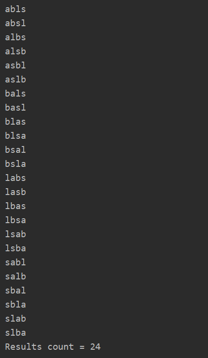

Воронов Вадим ИБ-119
# Лабораторная работа 8.
## Перестановка символов в строке. Вывод перестановок в алфавитном порядке.

Для выполнения данной задачи я использовал следующий алгоритм:
 1) Начальная строка преобразуется в массив char'ов. Далее создаем массив, в котором храним код каждого символа в unicode. Это позволяет сортировать массив с числами, а после преобразовывать числа обратно в символы для вывода в терминал.
 2) Сортируем массив с кодами символов. Я использовал сортировку вставками.
 3) Для получения всех возможных перестановок я реализовал рекурсивную функцию (nextStep).

В каждой перестановке должно быть столько же символов, сколько и в изначальной строке. На вход функции nextStep (в классе AbcStringPrinter) подается массив всех символов (в числовом представлении), существующих в строке. В цикле перебираем этот массив (исключая повторения с помощью сохранения уже использованных символов в BST), таким образом, мы заполняем первый символ в перестановках. Дальше через рекурсию заполняется второй символ, но уже без символа, который использован в первом вызове функции. Итак, к концу рекурсии у нас остается выбор лишь из одного символа, так как остальный уже были использованы, выводим строку, выходим из рекурсии.

 4) Выводим количество полученных перестановок. Если в строке не было повторяющихся символов, то должно получиться n! перестановок, где n - длина строки.

В Юникоде символы уже отсортированы в алфавитном порядке, однако сначала идут все заглавные буквы.

### Пример вывода программы:
Начальная строка: "labs"

